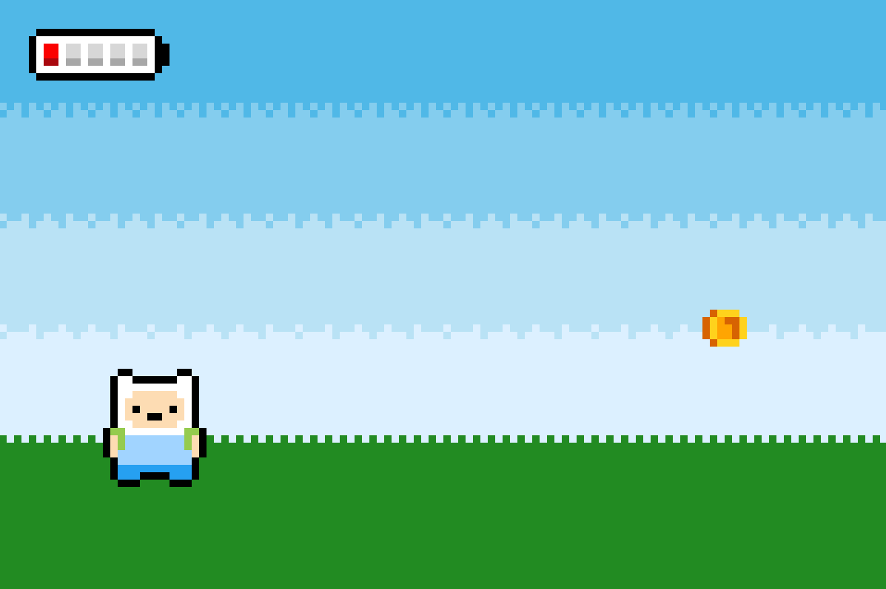

# Adventure time Game

## Overview
This project is a simple 2D OpenGL game implemented in C++. The game uses various graphical components and animations to simulate a fun and interactive environment. The player controls Finn, a character who collects coins, avoids walls, and earns points while progressing through the game.

## Features
- **Dynamic Background:** A multi-layered, colorful backdrop for the game environment.
- **Character (Finn):** Animated character with detailed rendering.
- **Collectibles:** Coins and batteries to earn points and keep the game engaging.
- **Obstacles:** Walls to avoid for maintaining health and progress.
- **Win/Loss Conditions:**
  - Win by collecting enough points.
  - Lose if certain conditions are not met.

## Controls
- Use the keyboard to control Finn’s movements (specific keys to be defined in the game loop).
- Collect coins and batteries to earn points.
- Avoid walls to prevent losing health.


## Dependencies
To compile and run this project, you need the following OpenGL libraries installed:
- `GL` (OpenGL)
- `GLU` (OpenGL Utility Library)
- `glut` (OpenGL Utility Toolkit)

### Ubuntu/Debian:
```bash
sudo apt-get install freeglut3-dev
```


## Installation
1. **Clone the Repository:**
   ```bash
   https://github.com/i-am-marwa-ayman/adventure-time-game.git
   cd adventure-time-game
   ```

2. **Compile the Code:**
   Use the following command to compile the project:
   ```bash
   g++ -o game main.cpp -lGL -lGLU -lglut
   ```

3. **Run the Game:**
   Execute the compiled binary:
   ```bash
   ./game
   ```

## How to Extend
- Add more characters or collectibles.
- Enhance Background Details.
- Realistic Movement.
